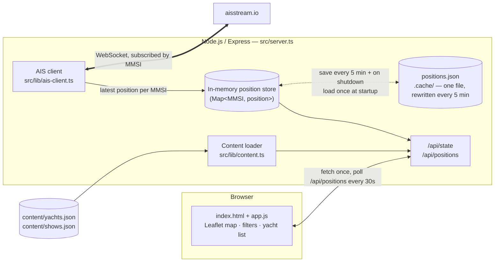
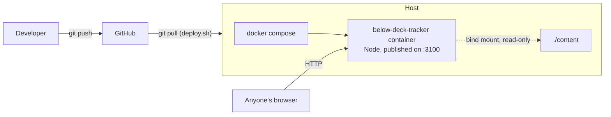

# Below Deck Tracker

A map of the **real** yachts behind Bravo's *Below Deck* franchise — Below Deck, Below
Deck Mediterranean, Sailing Yacht, Down Under and Adventure — tracked live using AIS
(the same system ships use to avoid hitting each other).

The yachts are given a fake charter name for each show. This app shows both: the name
you know it by from TV, and its real registered name, plus where it actually is right
now if it's broadcasting AIS.

---

## Running locally

```bash
./start.sh          # Node, restarts on save — everyday option
./start.sh --docker # Docker, hot reload
./start.sh --prod   # exact production image
```

Windows: `.\start.ps1`, `.\start.ps1 -Docker`, `.\start.ps1 -Prod`.

Open <http://localhost:3100>. VS Code: **Run Task** → `Tracker: run locally (watch)`
(`Cmd/Ctrl+Shift+B`).

### Live tracking (optional, but the whole point)

Without any setup the app runs fine — the yacht list, filters and map all work, every
yacht just shows as "not currently tracked". To see live positions:

1. Sign up free at [aisstream.io](https://aisstream.io) and grab an API key.
2. Copy `.env.example` to `.env` and set `AISSTREAM_API_KEY`.
3. Restart. The server log prints `[ais] connected — tracking N vessel(s)`.

Only yachts with a known MMSI in `content/yachts.json` can be tracked — see
[`content/README.md`](content/README.md) for how to add one.

## Deploying

```bash
./deploy.sh   # run from the repo root, on the server
```

Pulls `main`, runs `docker compose up -d --build`, prunes dangling images.

`content/` is bind-mounted — fixing a season number or adding a yacht just needs
`docker compose restart web`, no rebuild.

`.env` (copy from `.env.example`) sets the port and the aisstream.io key.
`docker-compose.yml` reads it automatically.

---

## How it's put together

The app is deliberately **stateless** — no database. The only "state" is the latest
known position per vessel, held in memory, which just refills itself from the live feed
a few minutes after any restart.





```
src/
  server.ts            Express app: static assets, API routes, 404, health check
  types.ts             Shared shapes: Show, YachtEntry, Position
  lib/
    config.ts           Environment variables, with defaults
    paths.ts             Filesystem locations, resolved in one place
    content.ts           Reads content/yachts.json + shows.json
    ais-client.ts        WebSocket client to aisstream.io — the live bit
    position-store.ts    In-memory latest-position-per-MMSI cache
    position-snapshot.ts Saves/restores that cache to .cache/positions.json
  routes/
    api.ts               GET /api/state, GET /api/positions
  public/                index.html, styles.css, app.js — no client framework
    vendor/leaflet/       Leaflet, self-hosted (see below)
content/
  shows.json             The five shows: name, colour, premiere year
  yachts.json             Every tracked yacht — see content/README.md to edit
```

**Frontend.** One static page, one dependency-free `app.js`. It fetches `/api/state`
once (shows + yachts + whatever positions are already known), renders the filters, the
map and the yacht list, then polls `/api/positions` every 30 seconds to move the markers.
Multi-select filters for both show and yacht are plain checkboxes/toggle buttons — no
framework needed for that.

**Map.** [Leaflet](https://leafletjs.com), self-hosted in `src/public/vendor/leaflet/`
rather than pulled from a CDN, so the app has no runtime dependency on a third-party
script host. The base layer is Esri's free Ocean basemap (an actual nautical chart —
bathymetry and depth soundings, no API key needed), with plain OpenStreetMap one click
away as a fallback via the layer switcher.

**Live tracking.** `src/lib/ais-client.ts` opens one WebSocket to
`wss://stream.aisstream.io/v0/stream`, sends a subscription naming every known MMSI from
`content/yachts.json`, and updates the in-memory store whenever a `PositionReport`
arrives. It reconnects with backoff if the connection drops. See
[aisstream.io/documentation](https://aisstream.io/documentation) for the full message
spec — the short version:

```jsonc
// → sent once, right after connecting
{
  "APIKey": "...",
  "BoundingBoxes": [[[-90, -180], [90, 180]]], // whole world — MMSI filter below does the real work
  "FiltersShipMMSI": ["227812340", "..."],
  "FilterMessageTypes": ["PositionReport", "ShipStaticData"]
}

// ← received per vessel update
{
  "MessageType": "PositionReport",
  "MetaData": { "MMSI": 227812340, "ShipName": "SIRIUS", "time_utc": "..." },
  "Message": { "PositionReport": { "Latitude": 43.5, "Longitude": 16.4, "Sog": 8.2, "Cog": 91 } }
}
```

**Why a global bounding box?** Charter yachts reposition between oceans between
seasons — a boat that works the Caribbean in winter might cross to the Mediterranean for
summer. `FiltersShipMMSI` already restricts the feed to just the named vessels, so a wide
box costs nothing and means the app never "loses" a yacht because it sailed off a
hand-drawn map edge.

**Not tracked, and why.** Not every yacht has a known MMSI — some fake names never got
matched back to a real, AIS-broadcasting vessel. Those show up in the list with
"not currently tracked" instead of a guess. See
[`content/README.md`](content/README.md) if you find one.

**Debugging "why isn't yacht X showing up".** Open `/api/debug` in a browser — it's plain
JSON, no login needed, nothing secret in it (the API key itself is never included). It
shows the AIS connection's own state (connected/reconnecting, last error, how many raw
messages have come in at all), whether the position snapshot restored on startup, and,
per MMSI, whether it's currently reporting or not. If `ais.connectionState` is
`"connected"` and `messagesReceived` is climbing but a specific MMSI is still in
`notReporting`, that vessel just isn't within range of one of aisstream.io's (terrestrial,
not satellite) receivers right now, or its transponder is off — not a bug. If
`messagesReceived` stays near zero, that points at the subscription itself (wrong/expired
key) rather than vessel coverage.

**Surviving a restart.** The position store also matters for a second reason: the
aisstream.io connection is a live stream, not something you can poll on demand, so every
browser tab shares that one connection instead of opening its own — no way to hit a rate
limit by having more visitors. The only gap is a restart/redeploy, where the in-memory
store would otherwise start empty until each vessel next reports in. `position-snapshot.ts`
covers that: it writes the current positions to `.cache/positions.json` every 5 minutes
and on shutdown, and reloads it at startup. It's one file, always fully overwritten (never
appended to), so it can't grow over time — worth knowing if you're tempted to reach for
Redis here, that's what it'd be replacing for no real benefit at this scale.

---

## The yachts

The mapping from TV name to real yacht is genuinely researched, not guessed — see
`content/yachts.json` and its `notes` fields for sourcing caveats on anything uncertain.
If you spot one that's wrong, that's a one-line JSON edit, not a code change.
